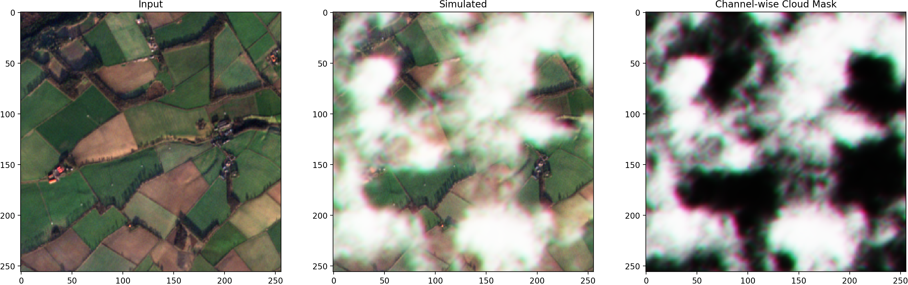
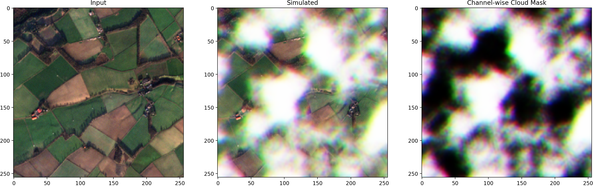
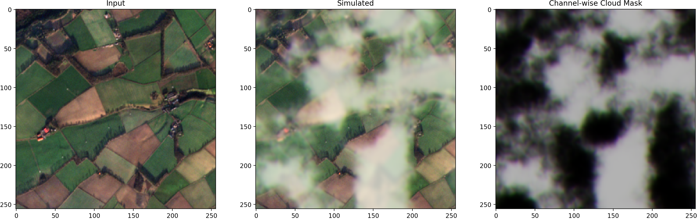

# :cloud: Satellite Cloud Generator
[](https://www.mdpi.com/2072-4292/15/17/4138) [](https://colab.research.google.com/github/cidcom/SatelliteCloudGenerator/blob/main/01c_Usage_Examples_Colab.ipynb) [](https://zenodo.org/badge/latestdoi/532972529)
[![[YouTube]](https://img.shields.io/badge/YouTube-%23FF0000.svg?style=flat&logo=youtube&logoColor=white)](https://youtu.be/RgAF2Y4O9zA)

:star: **NEW:** This tool has been featured in the 📺 first episode of the [**satellite-image-deep-learning podcast**](https://youtu.be/RgAF2Y4O9zA)! :star: 

---

A PyTorch-based tool for simulating clouds in satellite images.

This tool allows for generating artificial clouds in an image using structural noise, such as Perlin noise; intended for applications where pairs of clear-sky and cloudy images are required or useful.
For example, it can be used to **generate training data** for tasks such as **cloud detection** or **cloud removal**, or simply as a method of **augmentation** of satellite image data for other tasks.

The images must be in shape `(channel, height, width)` or `(batch, channel, height, width)` and are also returned in that format.

---

### Open Access Journal
This tool is accompanied by the **open access publication** at https://www.mdpi.com/2072-4292/15/17/4138.

If you found this tool useful, please cite accordingly:
```bibtex
@Article{rs15174138,
  author = {Czerkawski, Mikolaj and Atkinson, Robert and Michie, Craig and Tachtatzis, Christos},
  title = {SatelliteCloudGenerator: Controllable Cloud and Shadow Synthesis for Multi-Spectral Optical Satellite Images},
  journal = {Remote Sensing},
  volume = {15},
  year = {2023},
  number = {17},
  article-number = {4138},
  url = {https://www.mdpi.com/2072-4292/15/17/4138},
  issn = {2072-4292},
  doi = {10.3390/rs15174138}
}
```

### Installation
```bash
pip install git+https://github.com/strath-ai/SatelliteCloudGenerator
```

and then import:
```python
import satellite_cloud_generator as scg

cloudy_img = scg.add_cloud_and_shadow(clear_img)
```

## :gear: Usage
Basic usage, takes a `clear` image and returns a `cloudy` version along with a corresponding channel-specific transparency `mask`:
```python
cloudy, mask = scg.add_cloud(clear,
                             min_lvl=0.0,
                             max_lvl=1.0
                         )
```
...resulting in the following:



The `min_lvl` and `max_lvl` control the range of values of the transparency `mask`.

### Generator Module
You can also use a `CloudGenerator` object that binds a specific configuration (or a set of configurations) with the wrapped generation methods:
```python
my_gen=scg.CloudGenerator(scg.WIDE_CONFIG,cloud_p=1.0,shadow_p=0.5)
my_gen(my_image) # will act just like add_cloud_and_shadow() but will preserve the same configuration!
```

## Selected Features (There's more!)
Apart from synthesizing a random cloud, the tool provides several additional features (switched on by default) to make the appearance of the clouds more realistic, inspired by [(Lee2019)](https://ieeexplore.ieee.org/document/8803666).

### 1. Cloud Color
The `cloud_color` setting adjusts the color of the base added cloud based on the mean color of the clear ground image. (Disable by passing `cloud_color=False`)


---
### 2. Channel Offset
Spatial offsets between individual cloud image channels can be achieved by setting `channel_offset` to a positive integer value. (Disable by passing `channel_offset=0`)


---
### 3. Blur-Under-the-Cloud
Blurring of the ground image based on the cloud thickness can be achieved by adjusting the `blur_scaling` parameter (with `0.0` disabling the effect). (Disable by passing `blur_scaling=0`)
> :warning: The blur operation significantly increases memory footprint (caused by the internal `unfold` operation).


